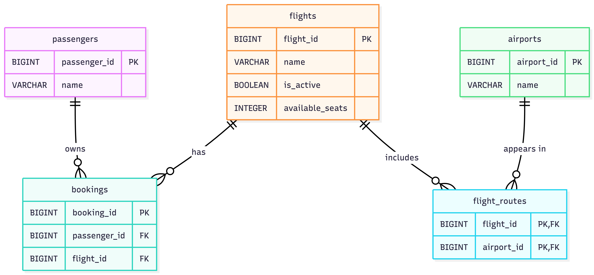

# Airline Booking System

**Name:** Abanoub Samaan

**Theme:** Airline Booking

This system manages airline flights, passengers, bookings, and routes through a relational database.

---
## Domain

The Airline Booking platform is designed to manage information related to flights, passengers, bookings, airports, and the routes connecting flights to airports. The system keeps track of passengers and their bookings, the flights available, and the airports associated with each flight. The goal is to organize this information in a relational database so that it can be stored, updated, and queried efficiently.

The platform should be able to answer questions such as which passengers are booked on a specific flight, which flights are associated with a specific airport, and which airports are part of a specific flight route. It should also allow us to find information about available seats, passengers, bookings, and flights, while maintaining the relationships between these different parts of the system.

---
## ERD

